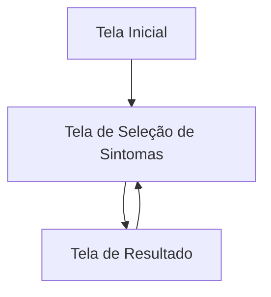
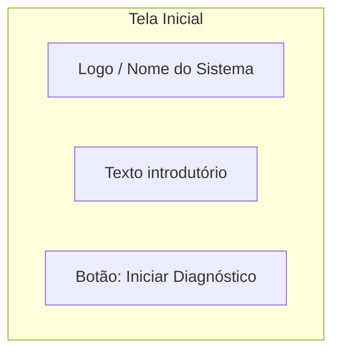
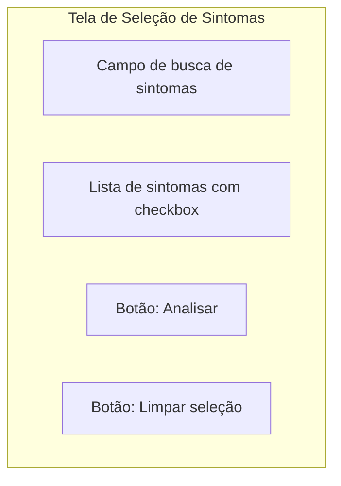
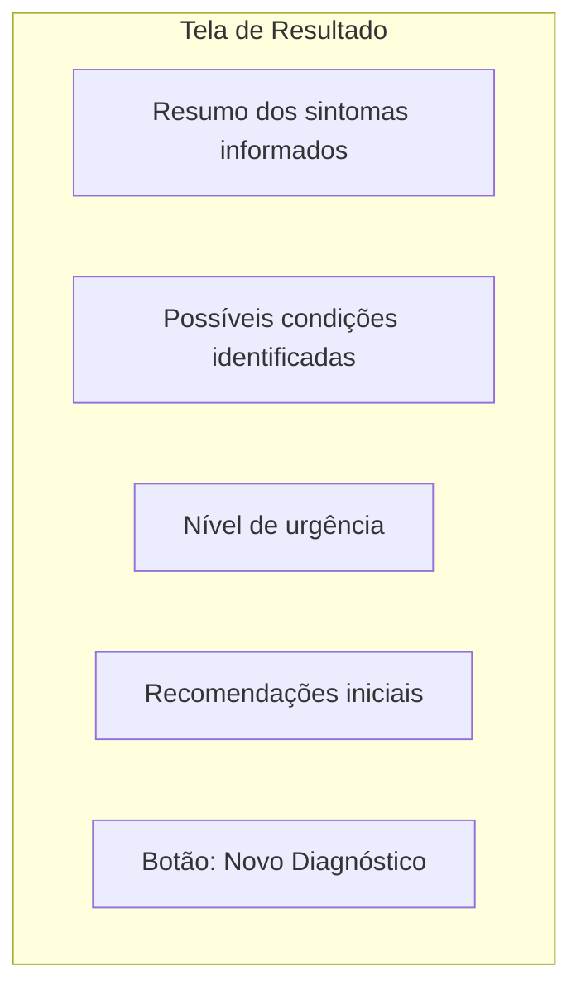
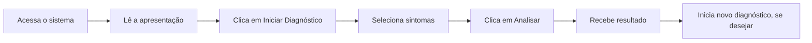

# 🧩 Wireframe - PrInt (Pré-Diagnóstico Inteligente)

Este documento apresenta um wireframe visual inicial das principais telas do sistema **PrInt**, com foco na estrutura da interface e no fluxo do usuário.

## 📌 Objetivo

Representar visualmente, de forma simples, como as telas do sistema poderão ser organizadas antes do desenvolvimento da interface final.

## 🖼️ Wireframe Visual Geral



## 1. 🏠 Tela Inicial



### Estrutura esperada
- Logo ou nome do sistema no topo
- Texto curto explicando a proposta do PrInt
- Botão principal para iniciar o fluxo

## 2. 🩺 Tela de Seleção de Sintomas



### Estrutura esperada
- Campo de busca para facilitar localização de sintomas
- Lista de sintomas selecionáveis
- Botão para enviar dados para análise
- Botão opcional para limpar seleção

## 3. 📊 Tela de Resultado



### Estrutura esperada
- Exibição dos sintomas escolhidos
- Resultado da análise do sistema
- Classificação de urgência
- Orientações básicas ao usuário
- Ação para reiniciar o processo

## 🔄 Fluxo Completo do Usuário



## 🧱 Wireframe em Blocos

### Tela Inicial

```text
+--------------------------------------------------+
|                 PrInt - Sistema                  |
|         Pré-Diagnóstico Inteligente              |
+--------------------------------------------------+
| Texto introdutório sobre o sistema               |
| e seu objetivo principal.                        |
|                                                  |
|           [ Iniciar Diagnóstico ]                |
+--------------------------------------------------+
```

### Tela de Seleção de Sintomas

```text
+--------------------------------------------------+
|              Seleção de Sintomas                 |
+--------------------------------------------------+
| Buscar sintoma: [__________________________]     |
|                                                  |
| [ ] Febre                                        |
| [ ] Tosse                                        |
| [ ] Dor de cabeça                                |
| [ ] Náusea                                       |
| [ ] Cansaço                                      |
| [ ] Dor no corpo                                 |
|                                                  |
|      [ Limpar ]        [ Analisar ]              |
+--------------------------------------------------+
```

### Tela de Resultado

```text
+--------------------------------------------------+
|                 Resultado da Análise             |
+--------------------------------------------------+
| Sintomas informados:                             |
| - Febre                                          |
| - Tosse                                          |
| - Cansaço                                        |
|                                                  |
| Possíveis condições:                             |
| - Gripe                                          |
| - Resfriado                                      |
|                                                  |
| Nível de urgência: MÉDIO                         |
|                                                  |
| Recomendações:                                   |
| Procurar avaliação médica se os sintomas         |
| persistirem ou piorarem.                         |
|                                                  |
|           [ Novo Diagnóstico ]                   |
+--------------------------------------------------+
```

## 📌 Observações

- Este wireframe representa apenas a estrutura inicial do sistema.
- O layout visual final poderá sofrer alterações durante o desenvolvimento.
- O objetivo aqui é guiar a construção da interface e alinhar a visão do projeto.

## 🚀 Próximo Passo

Após a validação deste wireframe, o próximo passo pode ser:
- criar o protótipo visual mais elaborado
- transformar em HTML/CSS
- iniciar a implementação das telas no frontend
